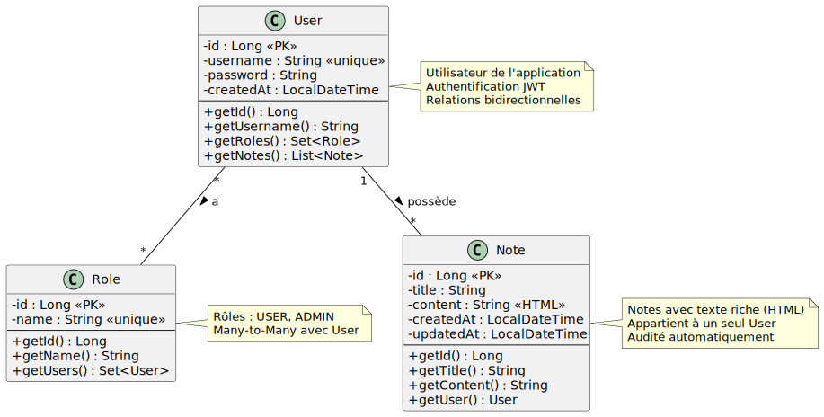

# 📝 Application Notes avec Spring Boot Security

Application de démonstration complète utilisant Spring Boot Security pour l'authentification et l'autorisation, avec un frontend Vue.js 3 moderne.

## 🎯 Objectif

Cette application démontre l'implémentation de Spring Security avec :
- **Authentification JWT** (JSON Web Tokens)
- **Gestion des rôles** (USER et ADMIN)
- **API REST sécurisée**
- **Frontend Vue.js 3** avec Composition API
- **Éditeur de texte riche** pour les notes
- **Base de données H2** pour le développement

## 🏗️ Architecture

### Backend (Spring Boot)
```
src/main/java/com/demo/notes/
├── NotesApplication.java          # Classe principale
├── model/                         # Entités JPA
│   ├── User.java                  # Utilisateur avec rôles
│   ├── Role.java                  # Rôles (USER, ADMIN)
│   └── Note.java                  # Notes avec texte riche
├── repository/                    # Repositories Spring Data JPA
│   ├── UserRepository.java
│   ├── RoleRepository.java
│   └── NoteRepository.java
├── service/                       # Logique métier
│   ├── UserDetailsServiceImpl.java
│   ├── UserService.java
│   └── NoteService.java
├── security/                      # Configuration de sécurité
│   ├── SecurityConfig.java        # Configuration Spring Security
│   ├── JwtUtils.java              # Génération/validation JWT
│   ├── JwtAuthenticationFilter.java
│   └── JwtAuthenticationEntryPoint.java
├── controller/                    # Contrôleurs REST
│   ├── AuthController.java        # Login
│   ├── UserController.java        # Gestion utilisateurs (Admin)
│   └── NoteController.java        # CRUD notes
├── dto/                          # Data Transfer Objects
│   ├── LoginRequest.java
│   ├── LoginResponse.java
│   ├── CreateUserRequest.java
│   ├── UserResponse.java
│   ├── NoteRequest.java
│   ├── NoteResponse.java
│   └── ErrorResponse.java
└── exception/                    # Gestion des exceptions
    └── GlobalExceptionHandler.java
```

#### Diagramme des Entités (Modèle de données)



### Frontend (Vue.js 3)
```
frontend/
├── src/
│   ├── main.js                   # Point d'entrée
│   ├── App.vue                   # Composant racine
│   ├── router/
│   │   └── index.js              # Configuration des routes
│   ├── stores/                   # Stores Pinia
│   │   ├── auth.js               # Gestion authentification
│   │   ├── notes.js              # Gestion notes
│   │   └── users.js              # Gestion utilisateurs
│   ├── views/                    # Vues principales
│   │   ├── LoginView.vue         # Page de connexion
│   │   ├── NotesView.vue         # Gestion des notes
│   │   └── UsersView.vue         # Gestion utilisateurs (Admin)
│   └── styles/                   # Styles globaux
│       ├── main.css
│       └── quasar-variables.sass
├── index.html
├── package.json
└── vite.config.js
```

## 🔐 Fonctionnalités de Sécurité

### Authentification JWT

1. **Login** : L'utilisateur envoie username/password
2. **Validation** : Spring Security vérifie les identifiants
3. **Token** : Un JWT est généré et renvoyé au client
4. **Requêtes** : Le client inclut le token dans l'en-tête `Authorization: Bearer <token>`
5. **Validation** : Chaque requête est validée par le `JwtAuthenticationFilter`

### Rôles et Permissions

#### Rôle USER
- ✅ Créer ses propres notes
- ✅ Lire ses propres notes
- ✅ Modifier ses propres notes
- ✅ Supprimer ses propres notes
- ❌ Accéder aux notes des autres utilisateurs
- ❌ Gérer les utilisateurs

#### Rôle ADMIN
- ✅ Toutes les permissions USER
- ✅ Créer de nouveaux utilisateurs
- ✅ Supprimer des utilisateurs
- ✅ Attribuer des rôles
- ✅ Lister tous les utilisateurs

## 🚀 Installation et Démarrage

### Prérequis

- **Java 17** ou supérieur
- **Maven 3.6+**
- **Node.js 18+** et **npm 9+** (installés automatiquement par le plugin Maven)

### Option 1 : Build et exécution complets (Production)

```bash
# Cloner le projet
cd notes

# Build complet (backend + frontend)
mvn clean package

# Démarrer l'application
java -jar target/notes-app-1.0.0.jar

# L'application est accessible à http://localhost:8080
```

Cette commande va :
1. Installer Node.js et npm (via frontend-maven-plugin)
2. Installer les dépendances frontend (npm install)
3. Builder le frontend Vue.js (npm run build)
4. Copier les fichiers buildés dans `src/main/resources/static`
5. Compiler le backend Spring Boot
6. Créer un JAR exécutable contenant le frontend et le backend

### Option 2 : Développement avec rechargement à chaud

#### Terminal 1 : Backend
```bash
# Démarrer le backend Spring Boot
mvn spring-boot:run

# Backend disponible sur http://localhost:8080
```

#### Terminal 2 : Frontend
```bash
# Aller dans le répertoire frontend
cd frontend

# Installer les dépendances (première fois uniquement)
npm install

# Démarrer le serveur de développement Vite
npm run dev

# Frontend disponible sur http://localhost:5173
```

En mode développement :
- Le frontend (port 5173) fait du proxy vers le backend (port 8080) pour les appels API
- Les modifications frontend sont rechargées automatiquement
- Les modifications backend sont rechargées avec Spring Boot DevTools

## 📊 Base de Données

### H2 Console

La console H2 est accessible pour inspecter la base de données :

- **URL** : http://localhost:8080/h2-console
- **JDBC URL** : `jdbc:h2:mem:notesdb`
- **Username** : `sa`
- **Password** : *(vide)*

### Données de Test

L'application est pré-remplie avec des utilisateurs et notes de test :

| Username | Password | Rôles | Description |
|----------|----------|-------|-------------|
| `admin` | `password` | ADMIN, USER | Administrateur avec tous les droits |
| `user1` | `password` | USER | Utilisateur standard avec 2 notes |
| `user2` | `password` | USER | Utilisateur standard avec 1 note |

## 🔌 API REST

### Endpoints d'Authentification

#### POST `/api/auth/login`
Connexion et obtention du token JWT.

**Requête :**
```json
{
  "username": "user1",
  "password": "password"
}
```

**Réponse :**
```json
{
  "token": "eyJhbGciOiJIUzUxMiJ9...",
  "type": "Bearer",
  "id": 2,
  "username": "user1",
  "roles": ["ROLE_USER"]
}
```

### Endpoints Notes (Authentification requise)

#### GET `/api/notes`
Récupère toutes les notes de l'utilisateur connecté.

**Headers :**
```
Authorization: Bearer <token>
```

**Réponse :**
```json
[
  {
    "id": 1,
    "title": "Ma première note",
    "content": "<p>Contenu en HTML</p>",
    "createdAt": "2024-01-01T10:00:00",
    "updatedAt": "2024-01-02T14:30:00",
    "userId": 2,
    "username": "user1"
  }
]
```

#### POST `/api/notes`
Crée une nouvelle note.

**Requête :**
```json
{
  "title": "Nouvelle note",
  "content": "<p>Contenu avec <strong>formatage</strong></p>"
}
```

#### PUT `/api/notes/{id}`
Met à jour une note existante.

#### DELETE `/api/notes/{id}`
Supprime une note.

### Endpoints Utilisateurs (Admin uniquement)

#### GET `/api/users`
Liste tous les utilisateurs.

#### POST `/api/users`
Crée un nouvel utilisateur.

**Requête :**
```json
{
  "username": "newuser",
  "password": "password123",
  "roles": ["ROLE_USER"]
}
```

#### DELETE `/api/users/{id}`
Supprime un utilisateur (et toutes ses notes en cascade).

## 🛠️ Technologies Utilisées

### Backend
- **Spring Boot 3.2.1** - Framework principal
- **Spring Security** - Authentification et autorisation
- **Spring Data JPA** - Persistance des données
- **H2 Database** - Base de données en mémoire
- **JJWT** - Génération et validation des JWT
- **Lombok** - Réduction du code boilerplate
- **Maven** - Gestion de build

### Frontend
- **Vue.js 3** - Framework progressif JavaScript
- **Vite** - Build tool ultra-rapide
- **Vue Router** - Routage SPA
- **Pinia** - Gestion d'état moderne
- **Quasar Framework** - Composants UI Material Design
- **Vue Quill** - Éditeur de texte riche
- **Axios** - Client HTTP

### Build
- **frontend-maven-plugin** - Intégration Maven/npm

## 📝 Points Clés de l'Implémentation

### 1. Sécurité JWT

Le token JWT contient :
- Le nom d'utilisateur (subject)
- La date d'expiration (24h par défaut)
- Une signature HMAC-SHA512

```java
// Génération du token (JwtUtils.java)
String token = Jwts.builder()
    .subject(username)
    .issuedAt(new Date())
    .expiration(new Date(System.currentTimeMillis() + expiration))
    .signWith(key, SignatureAlgorithm.HS512)
    .compact();
```

### 2. Filtre d'Authentification

Le `JwtAuthenticationFilter` intercepte chaque requête :
1. Extrait le token de l'en-tête `Authorization`
2. Valide le token (signature et expiration)
3. Charge les détails de l'utilisateur
4. Crée le contexte d'authentification Spring Security

### 3. Protection des Endpoints

```java
// Configuration dans SecurityConfig.java
.authorizeHttpRequests(auth -> auth
    .requestMatchers("/api/auth/**").permitAll()  // Public
    .anyRequest().authenticated()                  // Protégé
)
```

### 4. Autorisation par Rôle

```java
// Dans UserController.java
@PreAuthorize("hasRole('ADMIN')")
public ResponseEntity<List<UserResponse>> getAllUsers() {
    // Accessible uniquement aux admins
}
```

### 5. Éditeur de Texte Riche

Le composant Vue Quill fournit :
- Formatage de texte (gras, italique, souligné)
- Listes ordonnées et non ordonnées
- Titres et citations
- Code source
- Couleurs et alignement
- Nettoyage de formatage

```vue
<QuillEditor
  v-model:content="noteContent"
  contentType="html"
  theme="snow"
/>
```

### 6. Gestion d'État avec Pinia

Les stores Pinia centralisent la logique :
- **authStore** : Token, user, login/logout
- **notesStore** : Liste de notes, opérations CRUD
- **usersStore** : Gestion des utilisateurs

### 7. Guards de Navigation

Le router vérifie l'authentification avant chaque navigation :

```javascript
router.beforeEach((to, from, next) => {
  const isAuthenticated = authStore.isAuthenticated
  const isAdmin = authStore.isAdmin
  
  if (to.meta.requiresAuth && !isAuthenticated) {
    next('/login')
  } else if (to.meta.requiresAdmin && !isAdmin) {
    next('/')
  } else {
    next()
  }
})
```

## 🔧 Configuration

### application.properties

```properties
# Port du serveur
server.port=8080

# Base de données H2
spring.datasource.url=jdbc:h2:mem:notesdb
spring.h2.console.enabled=true

# JWT
jwt.secret=VotreCleSecreteTresLonguePourSignerLesTokensJWT2024!
jwt.expiration=86400000  # 24 heures en millisecondes
```

### Personnalisation

Pour modifier la clé secrète JWT :
1. Générer une nouvelle clé sécurisée (min. 64 caractères)
2. Mettre à jour `jwt.secret` dans `application.properties`

Pour changer la durée de validité du token :
- Modifier `jwt.expiration` (valeur en millisecondes)
- 3600000 = 1 heure
- 86400000 = 24 heures

## 🧪 Tests

### Tester l'API avec curl

```bash
# Login
curl -X POST http://localhost:8080/api/auth/login \
  -H "Content-Type: application/json" \
  -d '{"username":"user1","password":"password"}'

# Récupérer les notes (remplacer <TOKEN>)
curl -X GET http://localhost:8080/api/notes \
  -H "Authorization: Bearer <TOKEN>"

# Créer une note
curl -X POST http://localhost:8080/api/notes \
  -H "Authorization: Bearer <TOKEN>" \
  -H "Content-Type: application/json" \
  -d '{"title":"Test","content":"<p>Contenu</p>"}'
```

## 📦 Déploiement en Production

### Build du JAR

```bash
mvn clean package -DskipTests
```

Le JAR généré contient :
- Le backend Spring Boot
- Le frontend Vue.js buildé
- Toutes les dépendances

### Exécution

```bash
java -jar target/notes-app-1.0.0.jar
```

### Variables d'Environnement

Pour la production, utilisez des variables d'environnement :

```bash
export JWT_SECRET="VotreCleSecreteProductionTresLongueEtSecurisee123456789"
export SPRING_DATASOURCE_URL="jdbc:postgresql://localhost:5432/notesdb"

java -jar notes-app-1.0.0.jar
```

## 🐛 Dépannage

### Le frontend ne se charge pas

Vérifiez que le build Maven a réussi :
```bash
mvn clean package
```

Les fichiers frontend doivent être dans `target/classes/static/`.

### Erreur 401 Unauthorized

- Vérifiez que le token est valide et non expiré
- Assurez-vous que l'en-tête `Authorization: Bearer <token>` est correct
- Reconnectez-vous pour obtenir un nouveau token

### Console H2 inaccessible

Vérifiez que `spring.h2.console.enabled=true` dans application.properties.

### Erreur CORS

En développement, le frontend (5173) communique avec le backend (8080).
Le CORS est configuré dans `SecurityConfig.java` :

```java
configuration.setAllowedOrigins(Arrays.asList(
    "http://localhost:5173",
    "http://localhost:8080"
));
```

## 📚 Ressources

- [Spring Security Documentation](https://docs.spring.io/spring-security/reference/index.html)
- [JWT.io](https://jwt.io/) - Décodeur de tokens JWT
- [Vue.js 3 Documentation](https://vuejs.org/)
- [Quasar Framework](https://quasar.dev/)
- [Pinia](https://pinia.vuejs.org/)

## 👥 Auteur

Projet de démonstration pour l'enseignement de Spring Security.

## 📄 Licence

Ce projet est fourni à des fins éducatives.

---

**Note de Sécurité** : Ce projet est conçu pour la démonstration et l'apprentissage. Pour une utilisation en production, considérez :
- Utiliser une base de données persistante (PostgreSQL, MySQL)
- Stocker la clé JWT dans des variables d'environnement
- Implémenter une rotation des tokens (refresh tokens)
- Ajouter du rate limiting
- Implémenter HTTPS
- Ajouter des logs de sécurité
- Mettre en place des tests unitaires et d'intégration complets
